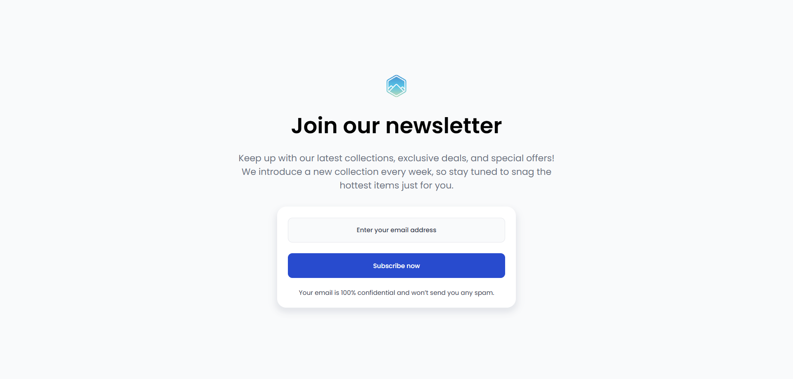

<h1 align="center">Join our newsletter | devChallenges</h1>

  <h3>
    <a href="https://dev-challenges-join-our-newsletter.vercel.app/">
      Demo
    </a>
     | 
    <a href="https://devchallenges.io/challenge/join-our-newsletter">
      Challenge
    </a>
  </h3>

## Overview

### What I learned

Responsive design without using media queries; CSS function clamp().

### Built with

- Semantic HTML5 markup
- CSS custom properties
